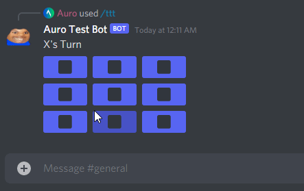

# Tic Tac Toe



Just a smol tic tac toe bot I made with the master branch of [discord.js](https://github.com/discordjs/discord.js)

This bot uses the new Discord slash commands and buttons

The bot may get rate limited if you click the buttons too fast.

#### If you have any problems, create an [issue](https://github.com/mrauro/discord-tic-tac-toe/issues/new)

### If you want to run this yourself, you will need:

-   [Discord Bot Application](https://discord.com/developers)
-   [NodeJS](https://nodejs.org)

Invite the bot to your server. To get the permissions to create the slash commands, you will need to grant it special permissions. Put your bot's client ID here and grant it permission:

`https://discord.com/api/oauth2/authorize?client_id=<---CLIENT ID HERE--->&scope=applications.commands`

Once you have sucessfully invited the bot to your server, you need to install the npm dependencies.

Run `npm install` to install all of the dependencies

Now you need to put your bot token in a `.env` file.
You will also need to put the guild ID of the server you want the bot to be in.

```
TOKEN=<TOKEN>
GUILD=<GUILD ID>
```

Start the bot with `node index.js` and it should be online!

You now need to deploy the slash commands. Use the `?deploy` command to deploy all of the commands to Discord.

Now you can do `/ping` and should get a response!

To start a tic tac toe game, type `/ttt` and click the buttons!

The winning event should be fine, however if there are any cases I missed, create an issue.
